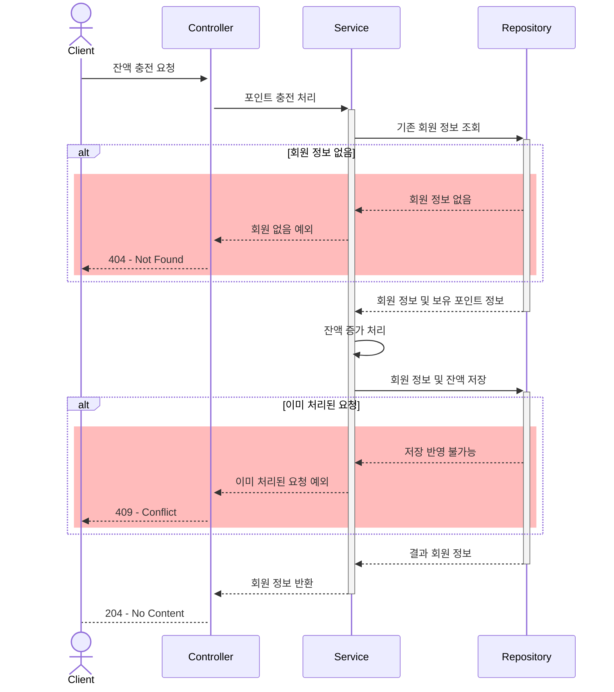
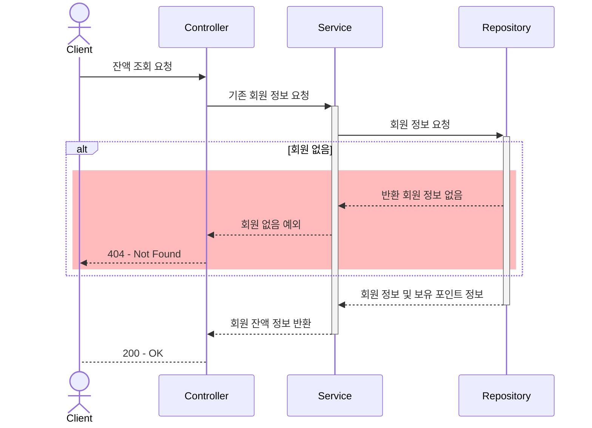
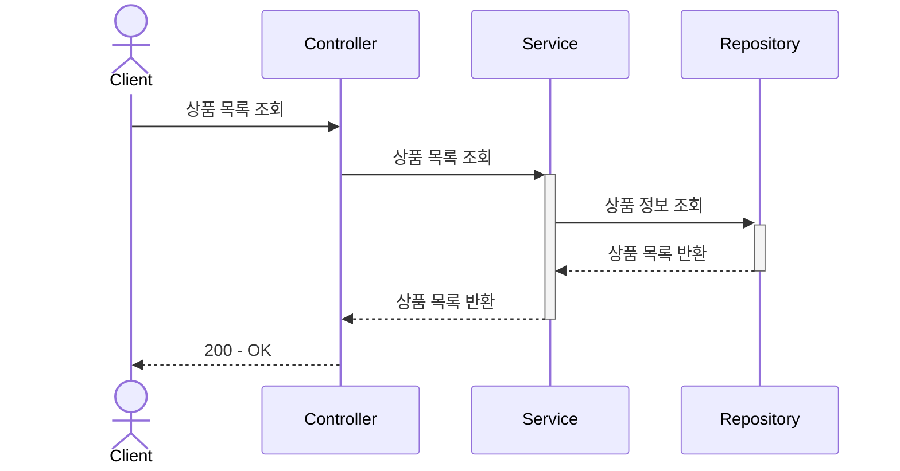
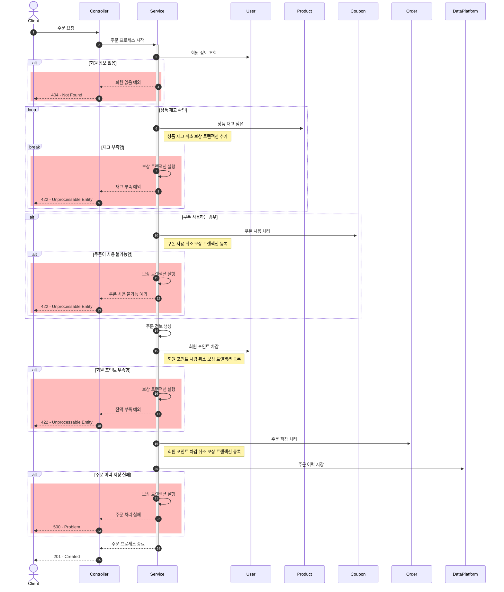
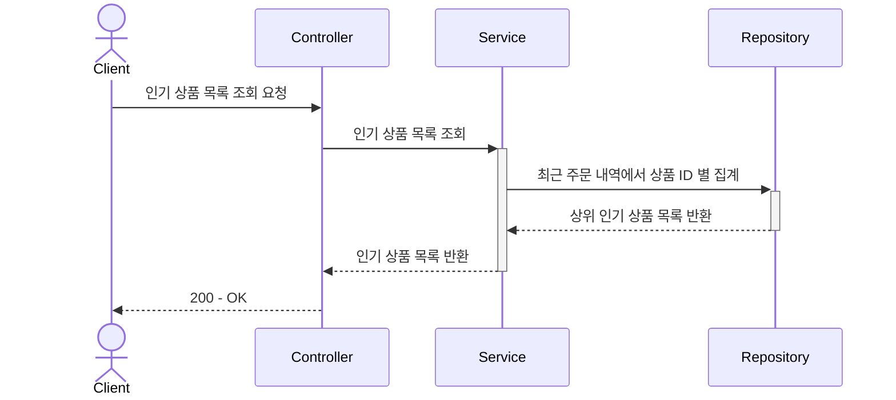
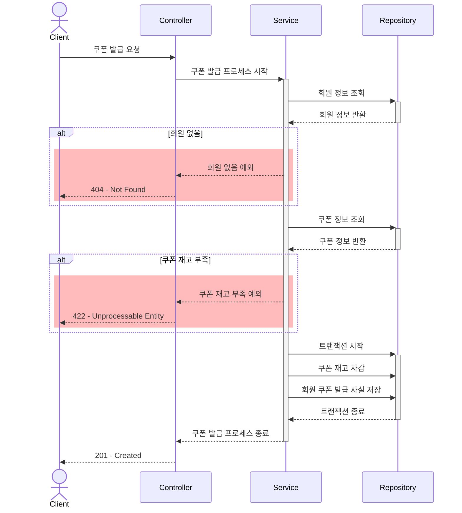
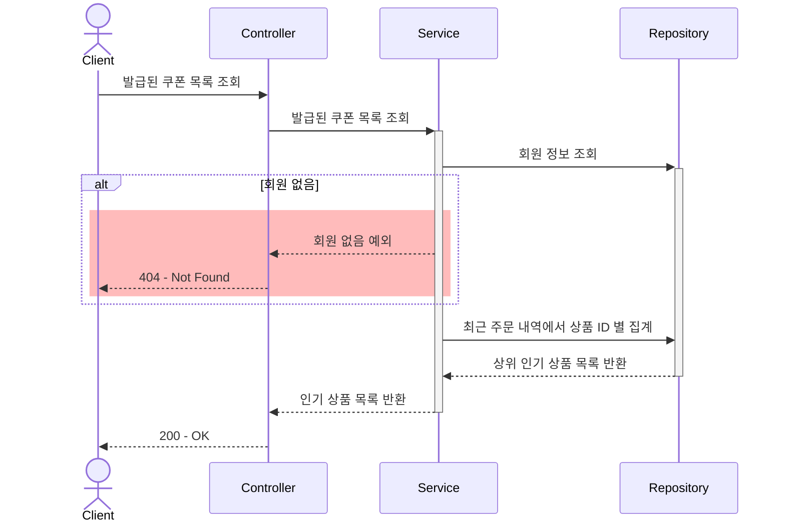

# 핵심 유스케이스

## 잔액 충전

```mermaid
sequenceDiagram
    actor Client    
    participant Controller
    participant Service
    participant Repository
    
    Client ->>+ Controller: 잔액 충전 요청
    Controller ->>+ Service: 포인트 충전 처리
    Service ->>+ Repository: 기존 회원 정보 조회
    
    alt 회원 정보 없음
        rect rgb(255, 30, 30, .3)
            Repository -->> Service: 회원 정보 없음
            Service -->> Controller: 회원 없음 예외
            Controller -->> Client: 404 - Not Found
        end
    end
    Repository -->>- Service: 회원 정보 및 보유 포인트 정보
    Service ->> Service: 잔액 증가 처리
    Service ->>+ Repository: 회원 정보 및 잔액 저장
    
    alt 이미 처리된 요청
        rect rgb(255, 30, 30, .3)
            Repository -->> Service: 저장 반영 불가능
            Service -->> Controller: 이미 처리된 요청 예외
            Controller -->> Client: 409 - Conflict
        end
    end
    
    Repository -->>- Service: 결과 회원 정보
    Service -->>- Controller: 회원 정보 반환
    Controller --> Client: 204 - No Content
```
## 잔액 조회

```mermaid
sequenceDiagram
    actor Client
    participant Controller
    participant Service
    participant Repository

    Client ->> Controller: 잔액 조회 요청
    Controller ->>+ Service: 기존 회원 정보 요청
    Service ->>+ Repository: 회원 정보 요청
    
    alt 회원 없음
        rect rgb(255, 30, 30, .3)
            Repository -->> Service: 반환 회원 정보 없음
            Service -->> Controller: 회원 없음 예외
            Controller -->> Client: 404 - Not Found
        end
    end 
    
    Repository -->>- Service: 회원 정보 및 보유 포인트 정보
    Service -->>- Controller: 회원 잔액 정보 반환
    Controller --> Client: 200 - OK
```

## 상품 목록 조회

```mermaid
sequenceDiagram
    actor Client
    participant Controller
    participant Service
    participant Repository

    Client ->> Controller: 상품 목록 조회
    Controller ->>+ Service: 상품 목록 조회
    Service ->>+ Repository: 상품 정보 조회
    Repository -->>- Service: 상품 목록 반환
    Service -->>- Controller: 상품 목록 반환
    Controller -->> Client: 200 - OK
```

## 주문 및 결제

```mermaid
sequenceDiagram
    autonumber
    actor Client
    participant Controller
    participant Service
    participant User
    participant Product
    participant Coupon
    participant Order
    participant DataPlatform
    
    %% 주문 / 결제 API
    Client ->> Controller: 주문 요청
    Controller ->>+ Service: 주문 프로세스 시작

    Service ->>+ User: 회원 정보 조회
    
    alt 회원 정보 없음
        rect rgb(255, 30, 30, .3)
            Service -->> Controller: 회원 없음 예외
            Controller -->> Client: 404 - Not Found
        end
    end
    
    loop 상품 재고 확인
        Service ->>+ Product: 상품 재고 점유
        note right of Service: 상품 재고 취소 보상 트랜잭션 추가

        break 재고 부족함
            rect rgb(255, 30, 30, .3)
                Service ->> Service: 보상 트랜잭션 실행
                Service -->> Controller: 재고 부족 예외
                Controller -->> Client: 422 - Unprocessable Entity
            end
        end        
    end
        
    alt 쿠폰 사용하는 경우
        Service ->>+ Coupon: 쿠폰 사용 처리
        note right of Service : 쿠폰 사용 취소 보상 트랜잭션 등록
        
        alt 쿠폰이 사용 불가능함
            rect rgb(255, 30, 30, .3)
                Service ->> Service: 보상 트랜잭션 실행
                Service -->> Controller: 쿠폰 사용 불가능 예외
                Controller -->> Client: 422 - Unprocessable Entity
            end
        end
    end
    
    Service ->> Service: 주문 정보 생성
    
    Service ->>+ User: 회원 포인트 차감
    note right of Service: 회원 포인트 차감 취소 보상 트랜잭션 등록
    
    alt 회원 포인트 부족함
        rect rgb(255, 30, 30, .3)
            Service ->> Service: 보상 트랜잭션 실행
            Service -->> Controller: 잔액 부족 예외
            Controller -->> Client: 422 - Unprocessable Entity
        end
    end
    
    Service ->>+ Order: 주문 저장 처리
    note right of Service: 회원 포인트 차감 취소 보상 트랜잭션 등록

    Service ->>+ DataPlatform: 주문 이력 저장
    alt 주문 이력 저장 실패
        rect rgb(255, 30, 30, .3)
            Service ->> Service: 보상 트랜잭션 실행
            Service -->> Controller: 주문 처리 실패
            Controller -->> Client: 500 - Problem
        end
    end
    
    Service -->>- Controller: 주문 프로세스 종료
    
    Controller -->> Client: 201 - Created    
```

## 인기 상품 목록 조회

```mermaid
sequenceDiagram
    actor Client
    participant Controller
    participant Service
    participant Repository

    Client ->> Controller: 인기 상품 목록 조회 요청
    Controller ->>+ Service: 인기 상품 목록 조회
    Service ->>+ Repository: 최근 주문 내역에서 상품 ID 별 집계
    Repository -->>- Service: 상위 인기 상품 목록 반환
    Service -->>- Controller: 인기 상품 목록 반환
    Controller -->> Client: 200 - OK
```

## 쿠폰 발급

```mermaid
sequenceDiagram
    actor Client
    participant Controller
    participant Service
    participant Repository
    
    Client ->> Controller: 쿠폰 발급 요청
    Controller ->>+ Service: 쿠폰 발급 프로세스 시작
    
    Service ->>+ Repository: 회원 정보 조회
    Repository -->>- Service: 회원 정보 반환

    alt 회원 없음
        rect rgb(255, 30, 30, .3)
            Service -->> Controller: 회원 없음 예외
            Controller -->> Client: 404 - Not Found
        end
    end

    Service ->>+ Repository: 쿠폰 정보 조회
    Repository -->>- Service: 쿠폰 정보 반환
    
    alt 쿠폰 재고 부족
        rect rgb(255, 30, 30, .3)
            Service -->> Controller: 쿠폰 재고 부족 예외
            Controller -->> Client: 422 - Unprocessable Entity
        end
    end

    Service ->>+ Repository: 트랜잭션 시작
    
    Service ->> Repository: 쿠폰 재고 차감
    Service ->> Repository: 회원 쿠폰 발급 사실 저장
    
    Repository -->>- Service: 트랜잭션 종료
    
    Service -->>- Controller: 쿠폰 발급 프로세스 종료
    
    Controller -->> Client: 201 - Created
```

## 발급된 쿠폰 목록 조회

```mermaid
sequenceDiagram
    actor Client
    participant Controller
    participant Service
    participant Repository

    Client ->> Controller: 발급된 쿠폰 목록 조회
    Controller ->>+ Service: 발급된 쿠폰 목록 조회
    Service ->>+ Repository: 회원 정보 조회
    alt 회원 없음
        rect rgb(255, 30, 30, .3)
            Service -->> Controller: 회원 없음 예외
            Controller -->> Client: 404 - Not Found
        end
    end
    Service ->> Repository: 최근 주문 내역에서 상품 ID 별 집계
    Repository -->>- Service: 상위 인기 상품 목록 반환
    Service -->>- Controller: 인기 상품 목록 반환
    Controller -->> Client: 200 - OK
```