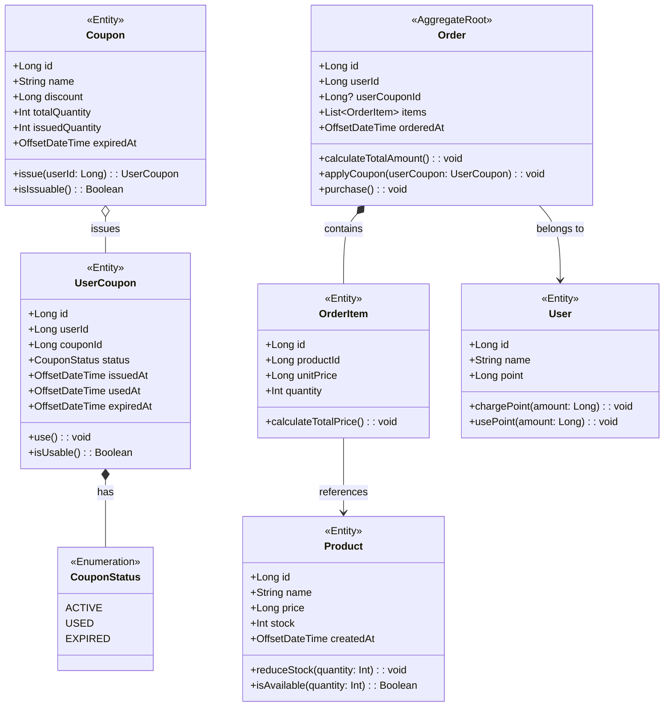

# 도메인 모델 정의

> ※ 과제에서 요구하는 최소한의 도메인 모델만 정의합니다.
> ※ DDD(Domain-Driven Design) 철학을 반영하여 Aggregate, Entity, Value Object로 구분

## 주요 도메인 클래스 다이어그램

```mermaid
classDiagram
    class User {
        <<Entity>>
        +Long id
        +String name
        +Long point
        
        +chargePoint(amount: Long): void
        +usePoint(amount: Long): void
    }
    
    class Product {
        <<Entity>>
        +Long id
        +String name
        +Long price
        +Int stock
        +OffsetDateTime createdAt
        
        +reduceStock(quantity: Int): void
        +isAvailable(quantity: Int): Boolean
    }    
    
    class Coupon {
        <<Entity>>
        +Long id
        +String name
        +Long discount
        +Int totalQuantity
        +Int issuedQuantity
        +OffsetDateTime expiredAt
        
        +issue(userId: Long): UserCoupon
        +isIssuable(): Boolean
    }
    
    class UserCoupon {
        <<Entity>>
        +Long id
        +Long userId
        +Long couponId
        +CouponStatus status
        +OffsetDateTime issuedAt
        +OffsetDateTime usedAt
        +OffsetDateTime expiredAt
        
        +use(): void
        +isUsable(): Boolean
    }
    
    %% Order Aggregate
    class Order {
        <<AggregateRoot>>
        +Long id
        +Long userId
        +Long? userCouponId
        +List~OrderItem~ items
        +OffsetDateTime orderedAt
        
        +calculateTotalAmount(): void
        +applyCoupon(userCoupon: UserCoupon): void
        +purchase(): void
    }
    
    class OrderItem {
        <<Entity>>
        +Long id
        +Long productId
        +Long unitPrice
        +Int quantity
        
        +calculateTotalPrice(): void
    }
    
    %% Enums
    class CouponStatus {
        <<Enumeration>>
        ACTIVE
        USED
        EXPIRED
    }
    
    %% Relationships
    Coupon o-- UserCoupon : issues
    UserCoupon *-- CouponStatus : has
    Order *-- OrderItem : contains
    Order --> User : belongs to
    OrderItem --> Product : references
```