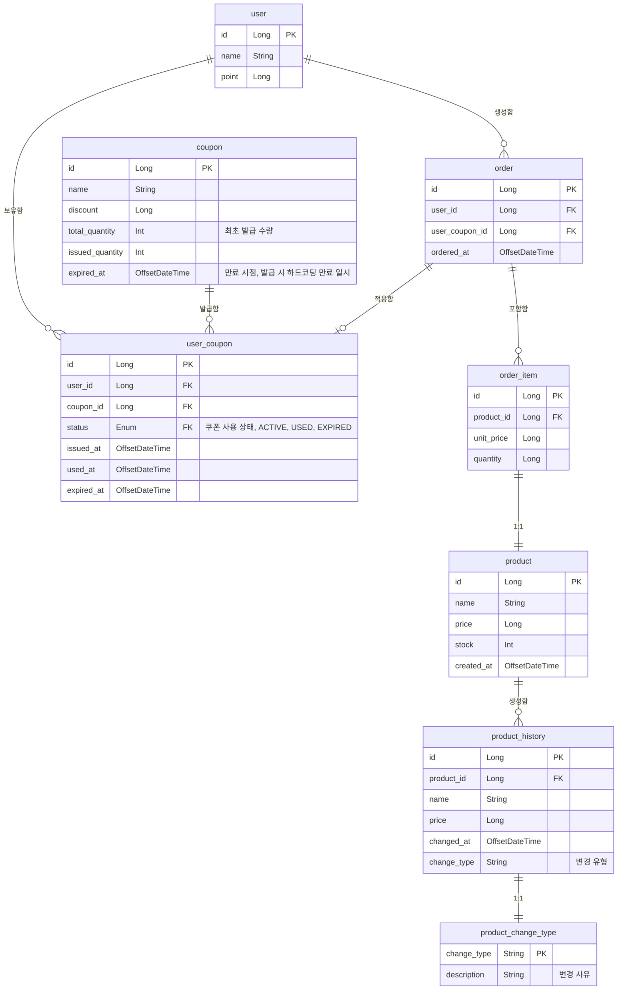

# Entity Relationship Diagram

```mermaid
erDiagram
    user {
        id Long PK
        name String 
        point Long
    }
    
    product {
        id Long PK
        name String 
        price Long
        stock Int
        created_at OffsetDateTime        
    }
    
    product_history {
        id Long PK
        product_id Long FK        
        name String
        price Long         
        changed_at OffsetDateTime
        
        change_type String "변경 유형"
    }
    
    product_change_type {
        change_type String PK
        description String "변경 사유"
    }
    
    coupon {
        id Long PK
        name String
        discount Long
        total_quantity Int "최초 발급 수량"
        issued_quantity Int 
        expired_at OffsetDateTime "만료 시점, 발급 시 하드코딩 만료 일시"
    }
    
    user_coupon {
        id Long PK
        user_id Long FK
        coupon_id Long FK
        status Enum FK "쿠폰 사용 상태, ACTIVE, USED, EXPIRED"
        issued_at OffsetDateTime
        used_at OffsetDateTime
        expired_at OffsetDateTime
    }
    
    order {
        id Long PK
        user_id Long FK
        user_coupon_id Long FK
        ordered_at OffsetDateTime        
    }
    
    order_item {
        id Long PK
        product_id Long FK
        unit_price Long 
        quantity Long
    }
    
    user ||--o{ order : "생성함"
        order ||--o{ order_item : "포함함"
        order_item ||--|| product : "1:1"
    
    user ||--o{ user_coupon : "보유함"
    coupon ||--o{ user_coupon : "발급함"
    order ||--o| user_coupon : "적용함"
    
    product ||--o{ product_history : "생성함"
        product_history ||--|| product_change_type : "1:1"
```