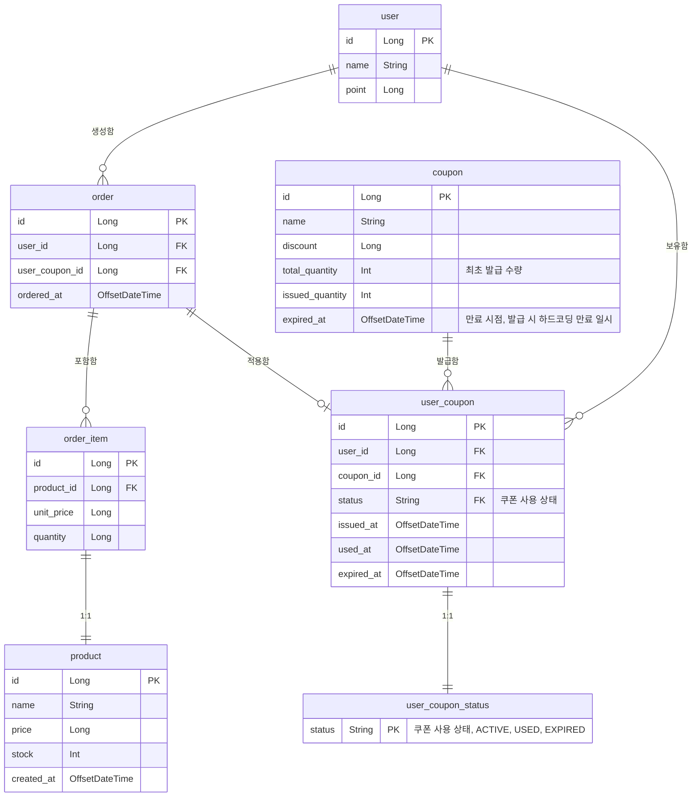

# Entity Relationship Diagram

```mermaid
erDiagram
    user {
        id Long PK
        name String 
        point Long
    }
    
    product {
        id Long PK
        name String 
        price Long
        stock Int
        created_at OffsetDateTime        
    }
    
    coupon {
        id Long PK
        name String
        discount Long
        total_quantity Int "최초 발급 수량"
        issued_quantity Int 
        expired_at OffsetDateTime "만료 시점, 발급 시 하드코딩 만료 일시"
    }
    
    user_coupon {
        id Long PK
        user_id Long FK
        coupon_id Long FK
        status String FK "쿠폰 사용 상태"
        issued_at OffsetDateTime
        used_at OffsetDateTime
        expired_at OffsetDateTime
    }
    
    user_coupon_status {
        status String PK "쿠폰 사용 상태, ACTIVE, USED, EXPIRED"
    }
    
    order {
        id Long PK
        user_id Long FK
        user_coupon_id Long FK
        ordered_at OffsetDateTime        
    }
    
    order_item {
        id Long PK
        product_id Long FK
        unit_price Long 
        quantity Long
    }
    
    user ||--o{ order : "생성함"
        order ||--o{ order_item : "포함함"
        order_item ||--|| product : "1:1"
    
    user ||--o{ user_coupon : "보유함"
    user_coupon ||--|| user_coupon_status : "1:1"
    coupon ||--o{ user_coupon : "발급함"
    order ||--o| user_coupon : "적용함"
```

