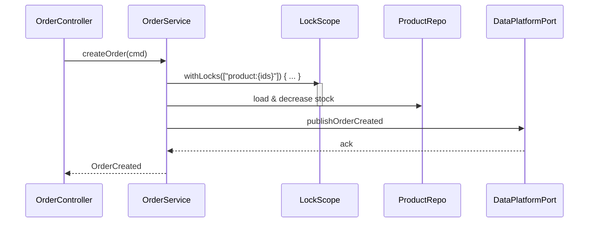

# 🔒 분산 락 도입 절차 및 결과 보고서

> 버전: 2025-08-15 · 담당: BE · 범위: 주문(Order) 도메인

---

## 📌 개요

* **목표**: 주문 생성 시 상품 리소스 경쟁을 제어하여 재고/포인트 등 정합성 보장
* **접근**: Redisson 기반 분산 락 + `LockScope` 추상화 도입(멀티락 지원)
* **비범위(Out of Scope)**: 글로벌 분산 트랜잭션, 사가 코레오그래피 변경, 전체 API 락 일괄 적용

---

## 🧭 배경 & 의사결정 요약

* AOP + SpEL 기반 키 추출 방식을 **탐색**했으나,

    * 멀티락 키 선언 복잡도, 팀의 AOP 학습 곡선, 테스트 가시성 이슈로 **`LockScope` 중심**으로 선회
* Redisson을 선택한 이유

    * 구현 성숙도, MultiLock/RMultiLock 제공, 락 재진입/리스 연장(Watchdog) 등 **운영 편의성**
* 트랜잭션 모델

    * 주문 API는 **보상 트랜잭션(`CompensationScope`)** 기반 → `@Transactional` AOP 충돌 우려 낮음

---

## 🏗️ 설계 개요

### 🔑 키 설계

* **락 키 스킴**: `product:{productId}`
* **멀티락 정렬 규칙**: **사전순 정렬** 후 획득(교차락 데드락 방지)

### 🧱 임계영역(critical section) 경계

* **임계영역 내부**: 상품 조회/검증, 재고 확인/차감 등 **상품 리소스**에 대한 원자적 조작
* **임계영역 외부**: [DataPlatformPort](../../src/main/kotlin/kr/hhplus/be/server/service/order/port/DataPlatformPort.kt) 호출(비핵심 경쟁 리소스)

### 🧩 추상화

* `LockScope.withLocks(lockClient, keys) { /* 핵심 로직 */ }`

    * 내부에서 **TTL/대기시간/재시도 정책** 설정 가능 (기본 제안: `wait=3s`, `lease=30s`)

---

## 🔧 구현 요약

* Redisson 등록 완료
* `LockScope` 기반 분산 락 적용
* 대상 도메인: **OrderService.createOrder**
* 참고 소스

    * [LockScope](../../src/main/kotlin/kr/hhplus/be/server/service/lock/LockScope.kt)
    * [CompensationScope](../../src/main/kotlin/kr/hhplus/be/server/service/transaction/CompensationScope.kt)

```kotlin
// 예시: LockScope 사용 패턴
suspend fun createOrder(cmd: CreateOrder): Order =
  LockScope.withLocks(lockClient, cmd.items.map { "product:${it.productId}" }) {
    val products = productRepo.findAllByIds(cmd.items.map { it.productId })
    validateAndDecreaseStock(products, cmd.items) // 임계영역 내부
  }.also {
    dataPlatformPort.publishOrderCreated(it) // 임계영역 외부
  }
```

---

## 🎯 도입 대상 선정 근거

1. **공개 API 중 경합 발생 가능성**: 현재 **주문 생성**이 유일하게 다중 회원 경합 가능
2. **경합 리소스**: 상품 → 상품 목록을 단위로 **멀티락** 필요
3. **외부 연동 경계**: DataPlatformPort 호출은 임계영역 **외부로 분리**
4. **트랜잭션 충돌**: 분산 트랜잭션(보상 패턴) 사용으로 `@Transactional` AOP 충돌 **우려 낮음**
5. **CompensationScope 상호작용**: 롤백 시나리오 검증 필요 → **Redis Testcontainers 기반** 보완 테스트 계획 수립

---

## 🧪 테스트 전략 (현황 & 계획)

### 현황

* 기능 수동 검증 완료(락 획득/해제, 정상 플로우)
* **미완**: Testcontainers + Redis 통합 환경에서의 **교차 시나리오(락+보상)** 자동화

### 계획

1. **환경 구성**: Redis Testcontainers 주입 → Spring `RedissonClient` 빈 구성
2. **경합 시나리오**: N 동시 주문 요청으로 재고 차감 경쟁 유발
3. **롤백 시나리오**: 중간 실패 유도(예: 결제/포인트 단계 예외) → `CompensationScope` 보상 실행 확인
4. **데드락/타임아웃**: 교차 키 집합으로 경쟁 → 대기시간 초과/재시도 동작 검증
5. **부하/성능 회귀**: P95/P99 응답시간, 성공률, 락 대기시간 KPI 수집

```kotlin
// 예시: 테스트 컨테이너 통합
@Testcontainers
@SpringBootTest
class OrderServiceRedisLockIT {
  companion object {
    @Container @JvmField
    val redis = GenericContainer("redis:7.2").withExposedPorts(6379)
  }
  @DynamicPropertySource
  fun redisProps(reg: DynamicPropertyRegistry) {
    reg.add("spring.data.redis.host") { redis.host }
    reg.add("spring.data.redis.port") { redis.getMappedPort(6379) }
  }

  @Test fun `경합 시 재고 정합성 보장`() = runBlocking {
    // given: 동일 상품에 대한 동시 주문 N건
    // when: awaitAll(...)로 동시 실행
    // then: 성공/실패 개수, 최종 재고 일관성, 락 대기시간 측정
  }
}
```

---

## 🧰 운영 설정 샘플

```kotlin
// RedissonClient Bean 예시
@Bean
fun redissonClient(
  @Value("\${spring.data.redis.host}") host: String,
  @Value("\${spring.data.redis.port}") port: Int
): RedissonClient = Redisson.create(Config().apply {
  useSingleServer().address = "redis://$host:$port"
    .setConnectionPoolSize(32)
    .setConnectionMinimumIdleSize(8)
})
```

```kotlin
// LockScope 내부 옵션 제안
data class LockOptions(
  val waitMillis: Long = 3_000,
  val leaseMillis: Long = 30_000,
  val fairness: Boolean = false
)
```

---

## 📊 모니터링 & KPI

* **락 대기시간**(ms): 평균, P95, P99
* **락 획득 실패율**(%): 타임아웃/취소 비율
* **경합률**: `lockContention = waiters / acquisitions`
* **처리량**: 주문/초
* **보상 실행률**: 보상 호출/주문
* **데드락 지표**: (설계상 0, 발생 시 즉시 알림)

> Micrometer로 커스텀 메트릭 노출 권장: `counter(order.lock.acquired)`, `timer(order.lock.wait)` 등

---

## ⚠️ 리스크 & 대응

* **데드락**: 키 정렬 획득 원칙 준수(사전순), 락 대기시간 상한 설정
* **Starvation**: 공정락(fair) 옵션 검토(성능-공정성 트레이드오프)
* **락 유실/연장**: Redisson **Watchdog**로 자동 연장, 임계영역 최소화
* **예외 시 누수**: `try/finally` 보장 해제, 보상 단계에서 **재고 복원** 일관성 검증
* **장시간 임계영역**: 외부 I/O 호출은 **항상 임계영역 밖**
* **재시도/멱등성**: 주문 식별자/토큰 기반 멱등 처리 권장

---

## 📈 결과 요약

1. **도입/동작 확인**: OrderService에 분산락 적용 및 기능 확인 완료
2. **보완 과제**: Testcontainers 통합 + 교차 시나리오(락×보상, 과열 경쟁, 타임아웃) 테스트 **미완**

---

## 🗺️ 향후 작업(Backlog)

* [ ] Redis Testcontainers 환경에서 **롤백/보상 교차 케이스** 자동화
* [ ] **성능 시나리오**: 경합률 5\~50% 구간별 P95 회귀 측정
* [ ] **모니터링 대시보드**(Grafana): 락 지표/KPI 시각화
* [ ] **운영 가이드**: 장애/타임아웃 시 재시도·알림 정책 문서화
* [ ] AOP + SpEL 키 추출 **부분 도입**(단일락/간단 케이스) 연구

---

## 📚 부록

### 🧪 시퀀스 다이어그램(개요)



### 🔗 파일 레퍼런스

* [LockScope](../../src/main/kotlin/kr/hhplus/be/server/service/lock/LockScope.kt)
* [CompensationScope](../../src/main/kotlin/kr/hhplus/be/server/service/transaction/CompensationScope.kt)
* [DataPlatformPort](../../src/main/kotlin/kr/hhplus/be/server/service/order/port/DataPlatformPort.kt)

---

> 문의/피드백 포인트: 테스트 커버리지 우선순위, KPI 임계치, 타임아웃/재시도 기본값
