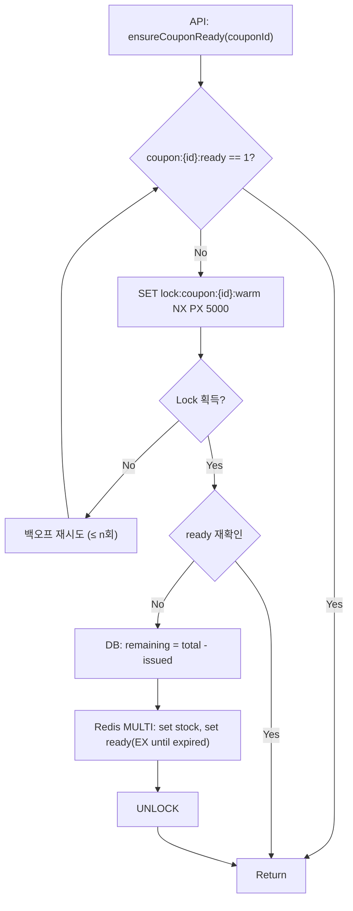
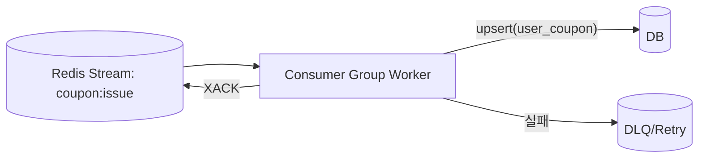
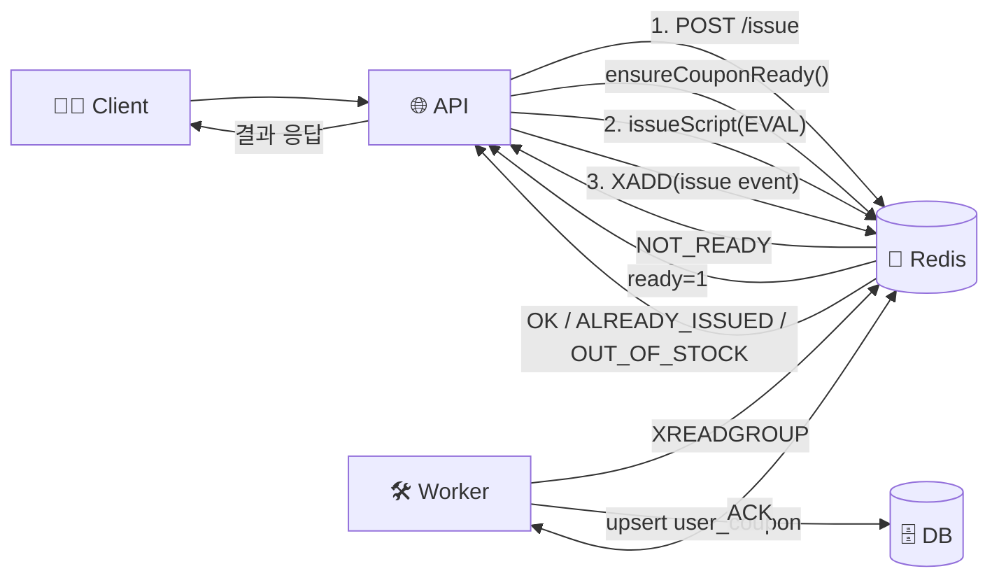

# 🎟️ 선착순 쿠폰 발급 재설계 및 기능 구현 결과 보고서

> **목표**: “선착순 + 1인당 1매”를 고성능/고가용성으로 보장. Redis를 **단일 실시간 소스**로 활용하고, DB는 **멱등 비동기 영속화**로 일관성을 수렴.

---

## 🧭 1. 범위 & 원칙

* **핵심 요구**: 선착순 소진, 중복 발급 금지, 높은 처리량
* **설계 원칙**

    * 발급 판단은 **Redis 원자 처리**로 끝낸다 (락 최소화)
    * DB는 **비동기 멱등 upsert**로 eventual consistency 보장
    * 콜드스타트/에비션 시에만 **짧은 분산 락**으로 단발 로딩(싱글플라이트)

---

## 🏗️ 2. 아키텍처 요약

* **Warm-Up(워밍)**: `coupon:{id}:stock`/`ready`를 DB로부터 1회성 적재 → `ready=1`이 **개문 신호**
* **Issue(발급)**: Lua 스크립트로 `이미 발급여부 검사 → 재고 확인 → 차감 → 발급마크`를 **원자** 실행
* **Persist(DB)**: 발급 성공 이벤트를 **Redis Streams**(권장) 또는 **List**에 기록 → 워커가 **멱등 upsert**

---

## 🗝️ 3. Redis 키 설계

| 키                             | 타입          | 예시                      | TTL       | 설명             |
|-------------------------------|-------------|-------------------------|-----------|----------------|
| `coupon:{id}:stock`           | String(Int) | `coupon:42:stock`       | 만료 시 삭제   | 남은 재고 수량(0 이상) |
| `coupon:{id}:ready`           | String("1") | `coupon:42:ready`       | 만료까지      | 워밍 완료/개문 신호    |
| `coupon:{id}:issued:{userId}` | String("1") | `coupon:42:issued:1001` | 만료까지      | 해당 유저 발급 여부    |
| `stream:coupon:issue`         | Stream      | `stream:coupon:issue`   | -         | 발급 성공 이벤트 스트림  |
| `lock:coupon:{id}:warm`       | String      | `lock:coupon:42:warm`   | PX 5\~10s | 워밍 단발 락        |

> `issued:{userId}`는 **발급 시점에만 생성**. 선로딩 불필요.

---

## 🔒 4. 초기 로딩(워밍) & 싱글플라이트

* `ready` 플래그가 없을 때만 **짧은 락 + 더블 체크**로 적재
* `stock`/`ready` 세팅은 **MULTI/EXEC** 또는 작은 Lua로 원샷

### 🔁 Flow – 워밍 로딩

---

## ⚙️ 5. 발급 처리(원자 스크립트 논리)

**단일 EVAL**로 다음을 원자 실행:

1. `EXISTS coupon:{id}:issued:{userId}` → 존재 시 `ALREADY_ISSUED`
2. `GET coupon:{id}:stock` → `<=0`이면 `OUT_OF_STOCK`
3. `DECR coupon:{id}:stock`
4. `SET coupon:{id}:issued:{userId} 1 EX <만료초>`

> 스크립트 진입 전 `coupon:{id}:ready == 1`을 검증. 아니면 `NOT_READY`로 반환 → `ensureCouponReady()` 1회 수행 후 재시도.

---

## 🚚 6. DB 영속화(비동기 멱등)

* **권장**: Redis **Streams + Consumer Group**

    * 성공 시 `XADD stream:coupon:issue * {issuanceId,couponId,userId,issuedAt}`
    * 워커: `XREADGROUP` → **upsert(user\_coupon)** → `XACK`
    * 실패: 재시도/지속 장애는 DLQ 이동 + 알람
* **간단 대안**: List(RPUSH/LPOP) + `@Scheduled` + ShedLock (유실/중복 처리 책임 증가)

### 📦 Flow – 워커/영속화

---

## 🔗 7. API ↔ Redis ↔ DB End-to-End 흐름

---

## 🧮 8. 스키마/제약(멱등성)

* `user_coupon`에 **UNIQUE(coupon\_id, user\_id)**
* upsert 시 **issuance\_id(멱등 토큰)** 포함하여 재시도 안전
* 조회 API는 운영 정책에 따라

    * Redis(실시간) → 응답 빠름, 최신성 우수
    * DB(영속 기준) → eventual delay 허용 안내 문구

---

## ⏱️ 9. TTL/수명 주기

* `coupon:{id}:ready`/`issued:{userId}` TTL은 **쿠폰 만료 시각**에 맞춤
* `coupon:{id}:stock`은 만료 시 삭제. 완판 시 `0` 유지

---

## 🧯 10. 장애/엣지 케이스

* **Redis 다운**: 발급 불가 → 즉시 실패(503 또는 429), 재시도 지침
* **워밍 중단**: 락 TTL(5\~10s)로 영구락 방지, 백오프-재시도
* **워커 지연**: Streams 적체 알람, 재시도/복구 후 일괄 반영

---

## 🧪 11. 테스트 계획(핵심 시나리오)

* 동시 10k 요청 시 **음수 재고 0건** 확인
* 동일 유저 반복 요청 → 1회 성공, 나머지 `ALREADY_ISSUED`
* 콜드스타트 병렬 진입 → **스탬피드 없음**(단발 워밍 확인)
* 워커 중단/재시작 → **중복 없이** DB 일관 반영
* 장애주입: Redis RTT 증가/부분 실패/워커 예외 → 알람 및 자동 회복

---

## 🔌 12. API 설계(개요)

* `POST /v1/coupons/{couponId}/issue`

    * 200 OK: `{ issuanceId, couponId, userId, issuedAt }`
    * 409 CONFLICT: `ALREADY_ISSUED`
    * 410 GONE: `OUT_OF_STOCK`
    * 503/429: `NOT_READY`(워밍 중) 또는 서비스 과부하

---

## 📈 13. 모니터링 & 알람

* 지표: 발급 성공/실패 리즌별, 스크립트 에러율, Redis RTT, Streams depth, 워커 처리 TPS/지연
* 알람: 완판 임계 도달, 워밍 반복 실패, DLQ 누적, Streams 적체 임계

---

## ✅ 14. 설계 요약(한 줄)

**워밍 시점만 락으로 직렬화, 실제 발급은 Redis 스크립트로 원자 처리, DB는 Streams 기반 멱등 영속화로 수렴** → 단순·고성능·운영 친화.
