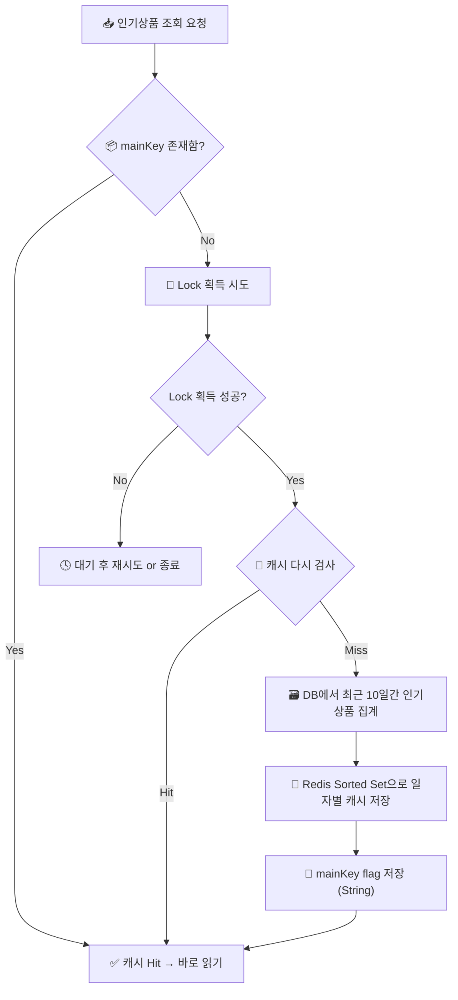

# 📦 주문 - 인기 상품 조회 캐싱 설계 보고서

## 🧱 1. 기초 설계 방향
### ✅ 주문 API는 보상 트랜잭션 기반으로 유지
- 주문 처리 완료 후에 통계/캐싱 용도의 처리를 분리
- 주문 처리 성공 이후에만 Redis 캐시 업데이트 수행 (비핵심 흐름)
### 🧠 인기 상품 캐시는 Lazy Loading 방식
- Cache 미존재 시에만 DB 접근
- Cache Hit 여부는 mainKey 기준 존재 확인 (Redis 재시작 전까지는 계속 Hit 유지)
### 🔓 조회 시 정합성 요구 낮음 → Dirty Read 허용
- 인기 상품 캐시는 마케팅/프론트 표시용
- 정확한 수치보다 경향성/순위 유지가 중요
- 별도 락 없이 정렬 데이터만 빠르게 읽어도 무방
---
## 🧩 2. Redis 키 설계 전략
- ### 캐시 키 구조
```css
{기능 키}:{날짜} → Sorted Set (ZSet)
예: popularProducts:2025-08-22
```
- ### ZSet 멤버 구조
- `member`: 직렬화된 인기상품 정보 (예: `RedisPopularProductSummaryCacheDto`)
- `score`: 해당 상품의 일간 판매량
- ### ZSet에 score 증가 (ZINCRBY)
- 주문 완료 후 즉시 score 증가 처리
- Redisson의 `addScore()` 메서드 사용
- 시간 복잡도 `O(log N)` → 고성능 처리 가능
---
## 🔄 3. Redis Cache Load 흐름
- 인기 상품 캐시가 비어 있을 경우에만 적재
- 분산 락 + double-check 방식 적용하여 쓰기 경합 방지
---
### ✅ FlowChart – Redis 캐시 적재 흐름

---
### 🧠 캐시 적재 조건 정리
| 조건         | 	처리                              |
|------------|----------------------------------|
| 캐시 존재	     | 바로 ZSet 읽기                       |
| 캐시 없음      | 	락 획득 시도 → 적재                    |
| 락 획득 실패	   | 다른 노드에서 적재 중일 수 있으므로 무리하지 않음     |
| 락 획득 후 재검사 | 	중복 적재 방지 (double-check pattern) |
---
## ✅ 4. 설계 요약
| 항목      | 	내용                             |
|---------|---------------------------------|
| 캐싱 대상	  | 최근 10일간의 인기 상품 목록 (일자별 집계)      |
| 저장 구조	  | Redis Sorted Set (ZSet)         |
| 저장 방식   | 	member = 직렬화된 DTO, score = 판매량 |
| 업데이트 시점 | 	주문 완료 직후                       |
| 조회 방식	  | Dirty Read 허용, 정합성 요구 낮음        |
| 락 전략	   | 분산 락 + 캐시 존재 재확인 (double-check) |