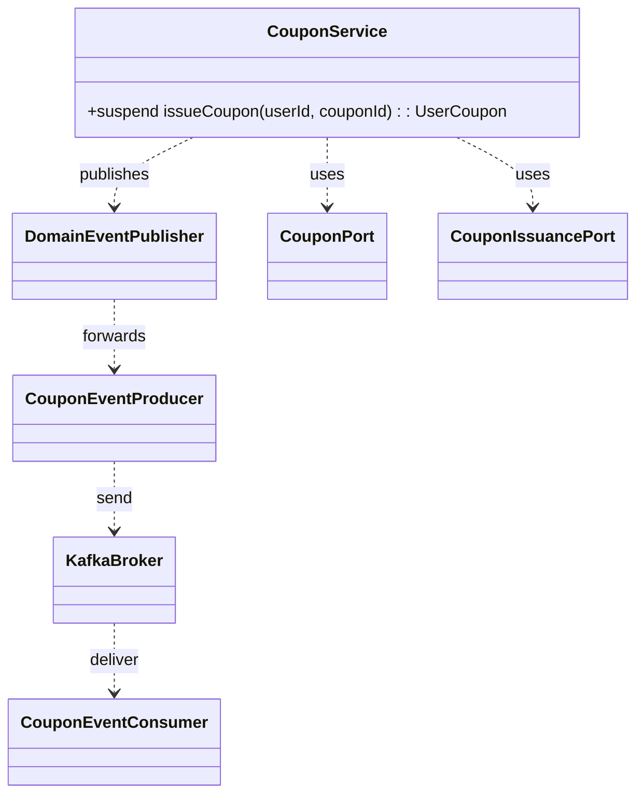
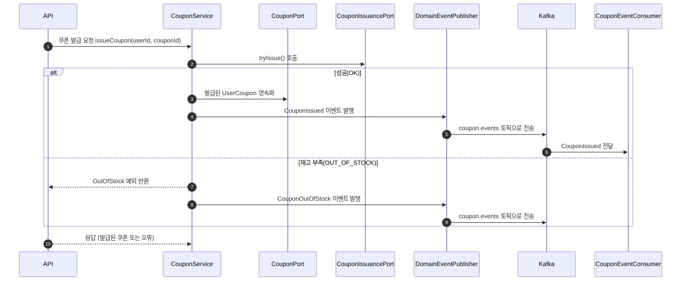

# Kafka Design: Coupon & Queue (STEP 18)

## 목표
- 쿠폰 발급/대기열 관련 시나리오에서 Kafka의 비동기 이벤트 스트림을 활용한다.
- 도메인 로직의 동기 결과를 유지하면서, 부수 효과/집계/관측은 Kafka 기반으로 분리한다.
- 최소 구현과 확장 가능성의 균형을 맞춘다.

## 범위
- 토픽: `order.events`(기존), `coupon.events`(신규 계획)
- 이벤트(계획): `CouponIssued`, `CouponOutOfStock`
- 소비(샘플): 인기상품 집계(완료), 쿠폰 이벤트 후속 처리(BI/대시보드 등, 후속)

## 토픽/키/스키마 규칙(권장)
- 토픽: 소문자, 도메인 중심 복수형. 예) `order.events`, `coupon.events`
- 키: 이벤트의 자연키(멱등성/파티셔닝 목적). 예) `orderId`, `couponId`
- 값: 이벤트 객체(JSON 직렬화). 현재는 도메인 이벤트 그대로 발행
- 헤더(선택): `eventType`, `schemaVersion` → 현재 최소화(미사용)

## 쿠폰: 이벤트 정의(초안)
- CouponIssued
```json
{
  "eventId": "<uuid>",
  "occurredAt": "2025-01-01T12:34:56+09:00",
  "couponId": 123,
  "userId": 456,
  "issuedUserCouponId": 789
}
```
- CouponOutOfStock
```json
{
  "eventId": "<uuid>",
  "occurredAt": "2025-01-01T12:35:12+09:00",
  "couponId": 123
}
```

## 클래스 다이어그램(개념)


## 시퀀스 다이어그램(쿠폰 발급)


## 대기열 모델(간단안)
- 단일 파티션(초기): 직렬 처리 보장 → 간단성 극대화
- 멀티 파티션(확장): 파티션 키 = 쿠폰/행사 ID → 동일 리소스 직렬성 유지, 수평 확장 가능

## 멱등성 전략(소비자)
- 키 기반 처리 상태 저장: `redis.setIfAbsent("evt:processed:{eventId}", 1, ttl=24h)`
- 처리 전 체크 → 중복 메시지 재처리 방지
- 장애 시 재시도/리밸런싱에도 안전

## 장애/운영 포인트(요약)
- DLQ(후순위): 소비 실패를 특정 토픽으로 라우팅해 조사 가능
- 모니터링: Lag, 처리율, 실패율을 Kafka UI/메트릭으로 확인
- 설정: AUTO_CREATE_TOPICS_ENABLE는 개발 편의 전용, 운영에서는 명시 생성 권장

## 구현 계획(최소)
1) `coupon.events` 발행 프로듀서 추가(CouponService에서 발행 지점 연결)
2) 필요한 경우 컨슈머 샘플 1종 추가(BI용 counter)
3) 멱등 키 도입(이벤트 ID 기반)

## 현재 상태
- 주문 이벤트 발행/소비(인기상품 집계) 완료
- 쿠폰 이벤트는 본 문서 안에 스펙 정의 → 후속 PR에서 단계적 구현
