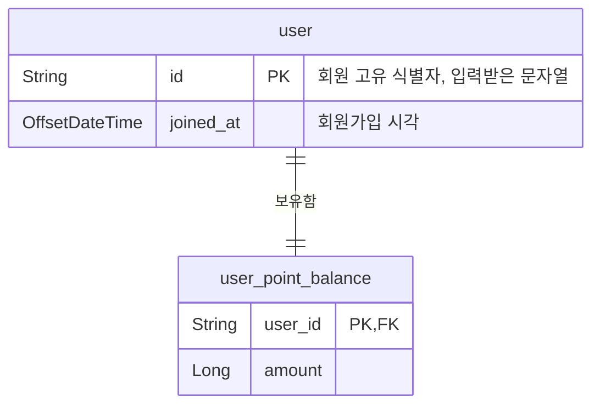

# 🗂️ Entity Relationship Diagram

- 전체 도메인에 대한 영속성 저장용 `ER 다이어그램`

# 📋 다이어그램

```mermaid
erDiagram
    user {
        String id PK "회원 고유 식별자, 입력받은 문자열"
        OffsetDateTime joined_at "회원가입 시각"
    }
    
    user_point_balance {
        String user_id PK,FK
        Long amount
    }
    
    user ||--|| user_point_balance : "보유함"
```