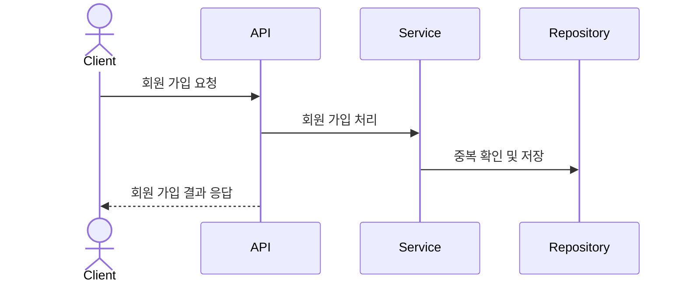
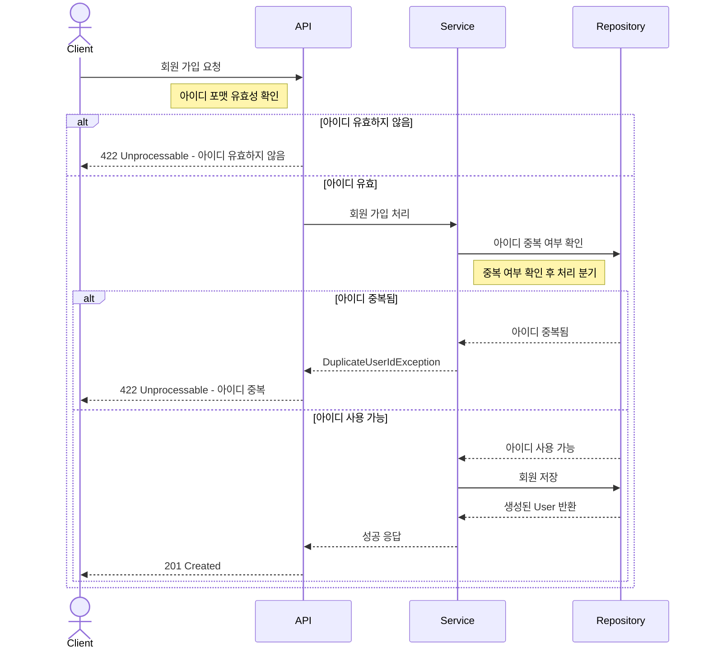
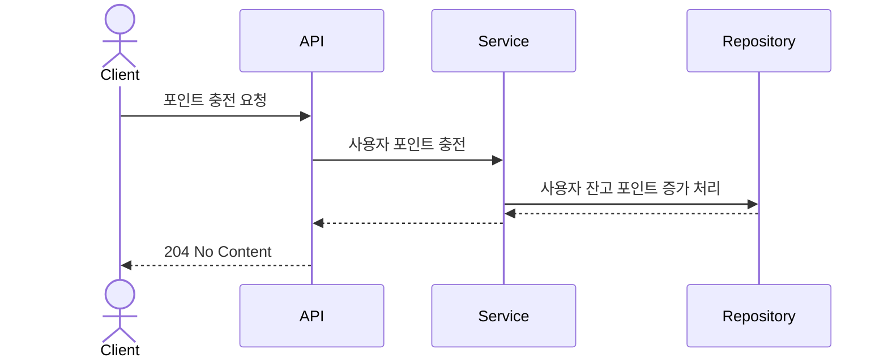
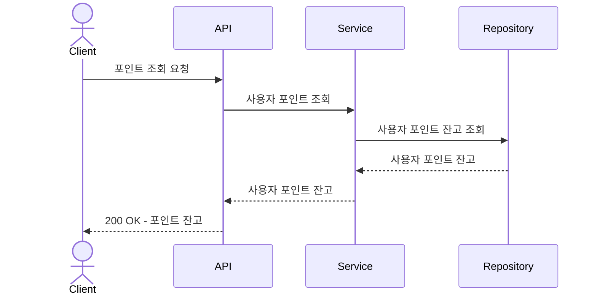

# 개요

- 주요 기능(행위)들의 시퀀스 다이어그램 모음

# 목록

### 1. 회원 가입 _Join_
> 참조: [user-requirements.md](user-requirements.md)

```mermaid
sequenceDiagram
    actor Client
    participant API
    participant Service
    participant Repository

    Client ->> API: 회원 가입 요청
    API ->> Service: 회원 가입 처리
    Service ->> Repository: 중복 확인 및 저장
    API -->> Client: 회원 가입 결과 응답
```

세부 분기 흐름

```mermaid
sequenceDiagram
    actor Client
    participant API
    participant Service
    participant Repository

    Client ->> API: 회원 가입 요청
    note left of API: 아이디 포맷 유효성 확인
    
    alt 아이디 유효하지 않음
        API -->> Client: 422 Unprocessable - 아이디 유효하지 않음
    else 아이디 유효    
        API ->> Service: 회원 가입 처리
        Service ->> Repository: 아이디 중복 여부 확인
        note right of Service: 중복 여부 확인 후 처리 분기
        
        alt 아이디 중복됨
            Repository -->> Service: 아이디 중복됨
            Service -->> API: DuplicateUserIdException
            API -->> Client: 422 Unprocessable - 아이디 중복        
        else 아이디 사용 가능
            Repository -->> Service: 아이디 사용 가능
            Service ->> Repository: 회원 저장
            Repository -->> Service: 생성된 User 반환
            Service -->> API: 성공 응답
            API -->> Client: 201 Created
        end
    end
```

### 2. 포인트 충전 _Charge Point_

```mermaid
sequenceDiagram
    actor Client
    participant API
    participant Service
    participant Repository
    
    Client ->> API: 포인트 충전 요청
    API ->> Service: 사용자 포인트 충전
    Service ->> Repository: 사용자 잔고 포인트 증가 처리
    Repository -->> Service : 
    Service -->> API : 
    API -->> Client : 204 No Content
```

### 3. 포인트 조회 _Read Point_

```mermaid
sequenceDiagram
    actor Client
    participant API
    participant Service
    participant Repository
    
    Client ->> API: 포인트 조회 요청
    API ->> Service: 사용자 포인트 조회
    Service ->> Repository: 사용자 포인트 잔고 조회    
    Repository -->> Service: 사용자 포인트 잔고
    Service -->> API: 사용자 포인트 잔고
    API -->> Client: 200 OK - 포인트 잔고
```

