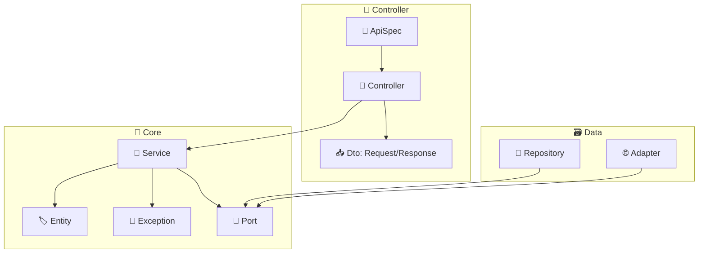

# 📁 kr.hhplus.be.server

## 폴더 구조

```text
kr.hhplus.be.server/
├── common/         # 공통 설정, Configuration 등 비즈니스 로직과 관련 있는 공통 요소
├── controller/     # REST API 엔드포인트
├── service/          # 비즈니스 로직, 도메인 모델
├── repository/    # 데이터 접근 계층 실 구현체
├── util/          # 공통 유틸리티, 순수한 로직만 분류
└── ServerApplication.kt
```

## 아키텍처

**Clean Architecture** 기반 레이어드 아키텍처  
**Spring Boot 3.x + Kotlin** + **DDD** 적용

## 🧩 구성 코드 요소

- ### Controller 레이어
    - `Controller` : class, API 엔드포인트 구현체
    - `ApiSpec` : interface, API 스펙, 문서 정의
    - `Dto` : 입력 용인 경우 `~~Request`, 출력 용인 경우 `~~Response` 패턴으로 명명
- ### Core 레이어
    - `Entity` : class, 고유하게 식별할 수 있는 도메인 객체, 외부 Entity 접근 자제
    - `Exception` : class, 도메인 내에서 발생할 수 있는 비즈니스 로직 예외
    - `Service` : class, 도메인 외부 노출 단위 기능의 정의 및 도메인 행위의 흐름 제어 (오케스트레이션)
    - `Port` : interface, Service에서 DI로 주입받아 사용할 외부 데이터 프로바이더
- ### Data 레이어
    - `Repository` : class, Port의 구현체, Core 레이어의 서비스를 주입받아 사용하는 것도 OK
    - `선택` `Adapter` : class, Port의 구현체, 데이터 저장소와 연동되지 않은 경우 강조하기 위해 표현 선택 가능 (외부 API, 메시지 큐 등)



## 구성요소

| 폴더                              | 역할                          |
|---------------------------------|-----------------------------|
| 🗂️ [common/](./common/)        | Spring Configuration, 공통 설정 |
| 🎯 [controller/](./controller/) | REST API 컨트롤러               |
| ⚙️ [core/](./service/)             | 비즈니스 로직, 도메인 서비스            |
| 🗄️ [data/](./repository/)            | 데이터 접근 리포지토리                |
| 🛠️ [util/](./util/)            | 공통 유틸리티 함수                  |