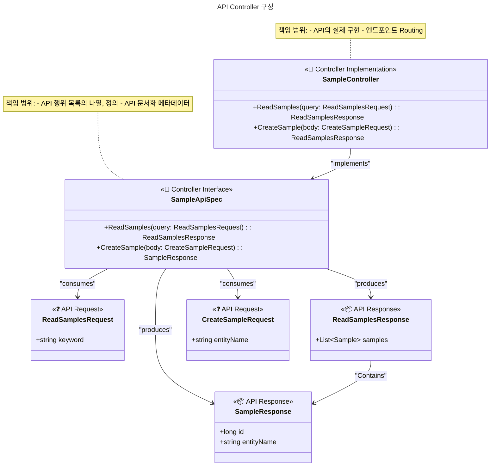

# 🎯 controller

## 폴더 구조

```text
controller/
├── api/v1/            # API v1 컨트롤러
├── dto/               # Request/Response DTO
│   ├── request/       # 요청 DTO
│   └── response/      # 응답 DTO
└── advice/            # 컨트롤러 공통 처리
    └── GlobalExceptionHandler.kt
```

## 역할

**REST API 엔드포인트 제공**: HTTP 요청/응답 처리 및 검증

## 🧬 구성 및 설계



---

> 상세한 개발 지침은 [instruction.md](./instruction.md) 참조
