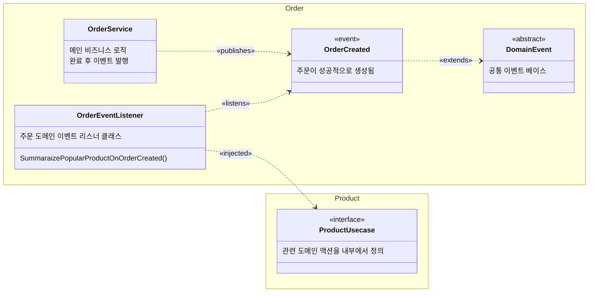

# 도메인 이벤트 설계 예시

## 원칙
- 이벤트는 상태 변경이 성공적으로 완료된 이후 Past Tense로 발행 (예: `OrderCreated`).
- 메인 오케스트레이션 흐름은 그대로 유지하고, 이벤트 리스너는 부수 효과만 담당.
- 리스너 실패는 상위로 전파하지 않으며(로그만), 본 플로우의 결과에 영향 주지 않음.
- 내부(in-process) 디스패치 기반. 외부 브로커/아웃박스는 추후 확장 범위.
- 공통 메타데이터 최소화: `eventId`, `occurredAt(Asia/Seoul)`.

```
service/
├── event/                                  # 도메인 이벤트 관련 공통 코드
│   ├── DomainEvent.kt                        # 도메인 이벤트 기본 클래스
├── {domain}/                               # 도메인 별 폴더
│   ├── event/                                # 도메인 별 발생 가능한 이벤트 폴더
│   │   ├── SomethingHappened.kt              # 도메인 이벤트, ~~했음 패턴
│   │   ├── OnSomethingHappendListener.kt     # 도메인 이벤트 리스너
│   │   ├── (선택){domain}EventListener.kt   # 이거 내부에 On~~ Pattern으로 리스너 함수 정의
...
```



## 구현 지침
- 이벤트 베이스: `open class DomainEvent(eventId: UUID = UUID.randomUUID(), occurredAt: ZonedDateTime = ZonedDateTime.now(Asia/Seoul))`
- 이벤트 예시: `data class OrderCreated(val orderId: Long, ...) : DomainEvent()`
- 발행 위치: 비즈니스 로직이 모두 성공적으로 끝난 직후(보상/롤백 범위를 벗어난 시점).
- 구독: `@EventListener`(필요 시 `@Async`). 실패는 로그만 남기고 종료.
- 패키징: `service/{domain}/event` 내 이벤트/리스너 배치.
- 향후 확장: 아웃박스/브로커 전환 시에도 이벤트 메타데이터 그대로 활용.

